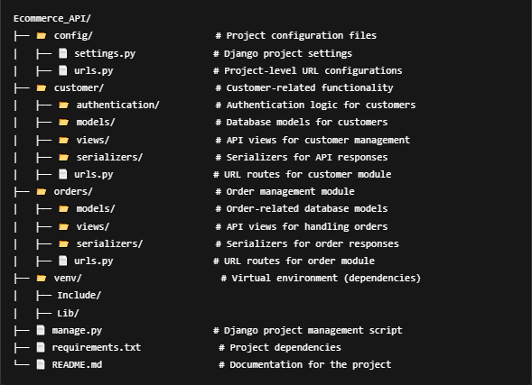
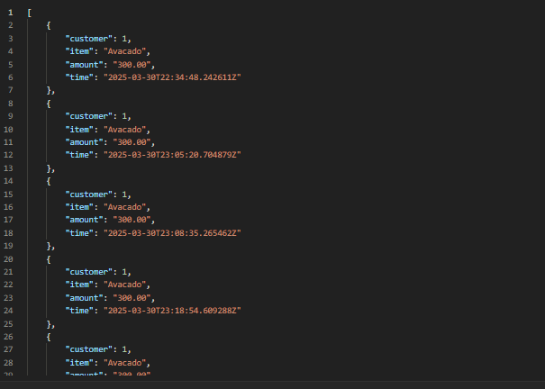
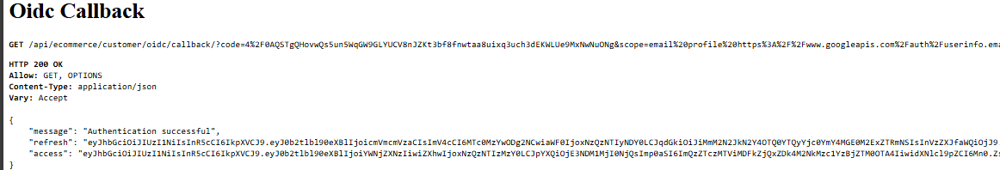

# Ecommerce API

A Django REST API for managing an eCommerce system, including customer management, order processing, and user account functionalities. The API provides OAuth2 authentication and supports modular endpoints for different services.

## Project Structure


## Technologies used
* [Django](https://www.djangoproject.com/): A Python web framework
* [DRF](www.django-rest-framework.org/): A powerful and flexible toolkit for building Web APIs

## Prerequisites
* [Python 3.x](https://www.python.org/downloads/)
* [Pip](https://pip.pypa.io/en/stable/installation/)
* [PostgreSQL](https://www.postgresql.org/download/)or any compatible database
* [Google Account](https://console.cloud.google.com/getting-started)  
* [Africa Talk SMS gateway](https://account.africastalking.com/apps/sandbox) 

## Setup Instructions
1. Clone the Repository:                                                                                                                                                          
    ```bash
        $ git clone https://github.com/kevi-t/Ecommerce_API 
    ```
2. Set Up Virtual Environment:                                                                                                                                                                                  
    ```bash
        $ python -m venv venv 
    ```
3. To activate the environment: source venv/bin/activate & On Windows use                                                                                                                                        
    ```bash
        $ venv\Scripts\activate
    ```
4. Install Dependencies:                                                                                                                                                                             
    ```bash
        $ pip install -r requirements.txt
    ```
5. Configure local settings add your secret keys for the Google account,Django secret and Africa Talk Sms gate way
6. Configure Environment Variables: Create a .env file in the root directory and add necessary environment variables; Google,AfricaTalking SECRET_KEY,DATABASE_URL
8. Run Migrations:                                                                                                                                                                                              
    ```bash
        $ python manage.py migrate
    ```
9. Run the Development Server:                                                                                                                                                                            
    ```bash
        $ python manage.py runserver
    ```
### Test Coverage
Run the following command to execute the unit tests: python manage.py test<br>
Continuous Integration (CI): This project uses GitHub Actions for continuous integration. 
The workflow is configured to run tests on every push to the repository.

### Key Features in This `README.md`:
1. **Project Structure**: Clearly outlined, showing how the project is divided into modules.
2. **Setup Instructions**: Step-by-step guide to get the API up and running locally.
3. **API Endpoints**: Sample endpoints for the main modules (customer, order).


### Testing the API on Postman
To simplify testing the API, you can download and import the provided Postman collection:
* [Ecommerce Local_postman_collection](https://github.com/kevi-t/Ecommerce_API/blob/master/Ecommerce.postman_collection.json)
* [Ecommerce Production_postman_collection](https://github.com/kevi-t/Ecommerce_API/blob/master/Ecommerce%20Production.postman_collection.json)<br>

Endpoints descriptions:
* Customer:
   ```bash
    POST[/api/ecommerce/customer/register/]: Creates a new customer.
    POST[/api/ecommerce/customer/login/]: Logs in a user and returns an authentication token.
    PUT[/api/ecommerce/customer/update/]: update user profile (requires Bearer token).
   ```

* Order:
   ```bash   
      POST[/api/ecommerce/order/place-order/]: Creates a new order.(requires Bearer token)
      GET[/api/ecommerce/order/list/]: Fetches the list of orders. (requires Bearer token)
   ```
* OpenID connect/Google Sigin: paste on a browser to obtain the access Token
   ```bash  
      http://localhost:8000/api/ecommerce/customer/oidc/login/
      https://ecommerce-api-alpha-dun.vercel.app/api/ecommerce/customer/oidc/login/
   ```
### Expected Sample Outputs
#### Register Endpoint
   
#### Login Endpoint

#### Place order Endpoint

#### Order List Endpoint

#### OpenID connect endpoint


### Process flow Diagram


### Deployment
* [Vercel](https://vercel.com/): Deployment of my Django App
* [Railway](https://railway.com/): Deployment of my Postgre database service

### Resources
* [Django docs](https://docs.djangoproject.com/): Django documentation 
